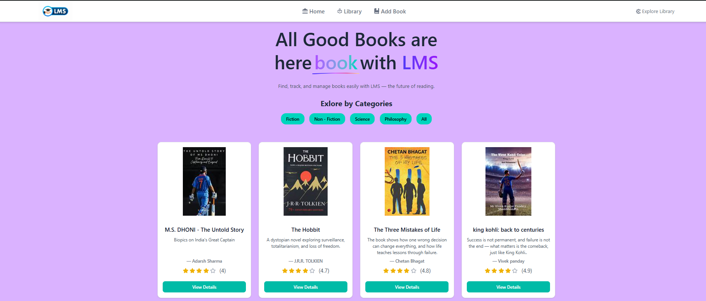

# 📚 LMS (Library Management System)

LMS is a modern React + Vite web application designed to help users discover, search, and manage books effortlessly. It offers category-based browsing, real-time search, and the ability to add and track personal books using Redux state.

---

## 🚀 Features
- 📖 Browse books by category (via sidebar and navigation)
- 🔍 Search books by title or author (covers both catalog and user-added books)
- 📘 Detailed book view with ratings and rich descriptions
- ➕ Add and manage your own books (stored in Redux)
- 📱 Fully responsive UI for all screen sizes
- ⚠️ Custom error page for invalid routes

---

## 🛠️ Tech Stack
- ⚛️ React 19 + Vite
- 🎨 Tailwind CSS v4
- 🗂️ Redux Toolkit (state management)
- 🌐 React Router (navigation)
- 🎯 Lucide Icons / React Icons

---

## ⚙️ Getting Started

### Prerequisites:
- Node.js (v18 or higher)
- npm

### Installation:
```bash
npm install
npm run dev     # Start development server (http://localhost:5173)
npm run build   # Create production build

src/
├── main.jsx            # Routing setup
├── App.jsx             # Application layout
├── pages/              # Page components
│   ├── BrowseBooks.jsx
│   ├── AddedBooks.jsx
├── components/         # Reusable UI components
│   ├── BookList.jsx
│   ├── BookCard.jsx
│   ├── BookDesc.jsx
│   ├── AddBook.jsx
│   ├── Header.jsx
│   ├── Footer.jsx
│   ├── SideBar.jsx
├── utils/              # Data & state management
│   ├── BooksData.js
│   ├── appStore.js
│   ├── bookSlice.js


## Author
Developed by **LIKU PRADHAN**

## Github link :- 
https://github.com/liku9/LMS

## Project Layout Screenshot
## 📸 Preview
